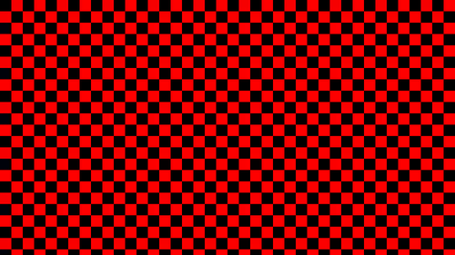

# Imagelib

Short and simple static/shared library to create image

## Ready to start

```console
$ make prog1
$ ./main
$ make prog2
$ ./main
$ make prog_static
$ ./main
$ make prog_dyn
$ ./main
```

The main.c program is just an exemple of use. It can create 60 images in either BMP or PPM format


## Usefull command :

> To generate mp4 file :

```console
$ ffmpeg -i test_%02d.ppm -r 60 test.mp4
```
> Can also be done by a make command:

```console
$ make create_video
```

> To play the video in while :

```console
$ mpv test.mp4 --loop-file=yes
```

> Can also be done by a make command:

```console
$ make play_video
```

## Example:

[](/picture)
