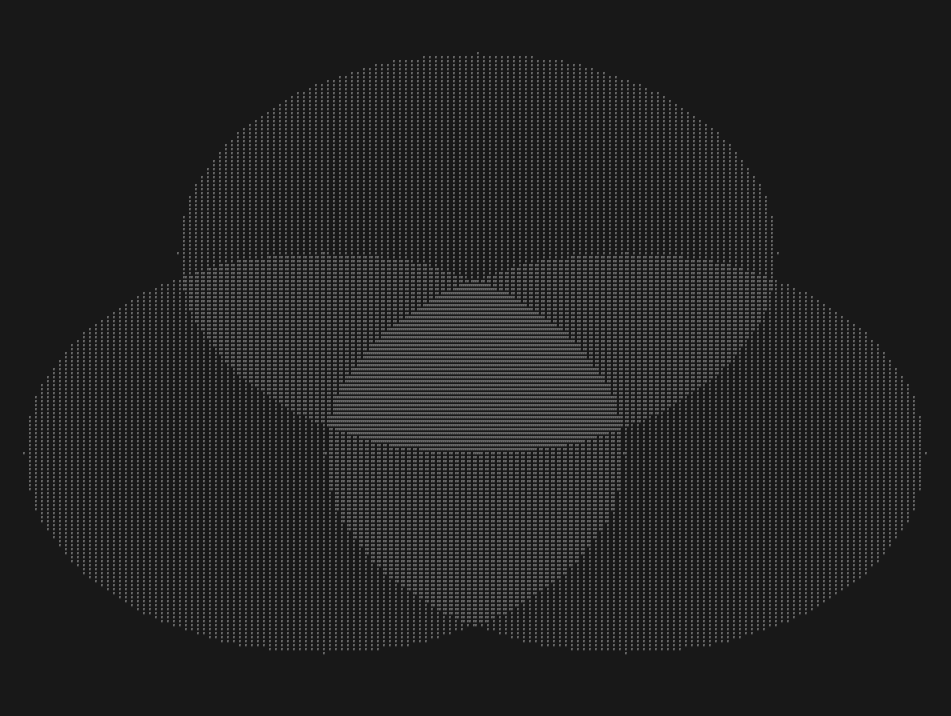

# Imagelib

Short and simple static/shared library to create and read images

## Ready to start

```console
$ make header
$ ./WriteMovingCheckerImage
$ ./WriteRGBAdditiveCircle24bImage
$ ./WriteRGBAdditiveCircle8bImage
$ ./WriteWhiteNoiseImage
$ ./ReadImage
$ ./ConsImage
$ ./ConsAnimation
$ make clean
```

All the Write...Image programs are exemples of uses. the MovingChecker and WhiteNoise programs can create 60 images in either BMP or PPM format that can be read and visualized with ConsAnimation. This lib can create 8b or 24b either in BMP or PPM format but can only read PPM file format 

## Usefull command :

> To generate mp4 file :

```console
$ ffmpeg -i test_%02d.ppm -r 60 test.mp4
```
> Can also be done by a make command:

```console
$ make create_video
```

> To play the video in loop :

```console
$ mpv test.mp4 --loop-file=yes
```

> Can also be done by a make command:

```console
$ make play_video
```

## Example:

```console
$ WriteMovingCheckerImage 1
```
[](/picture)

```console
$ WriteRGBAdditiveCircle8bImage
$ ./ConsImage stock/RGBAdditiveCircle8b.ppm
```

[](/picture)

```console
$ ./WriteRGBAdditiveCircle24bImage
$ ./ConsImage stock/RGBAdditiveCircle24b.ppm
```

[](/picture)

